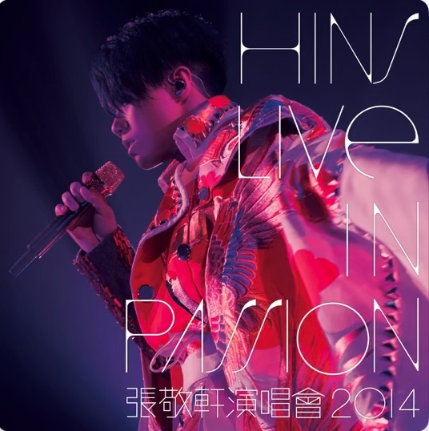
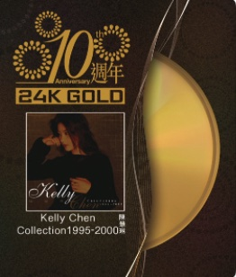
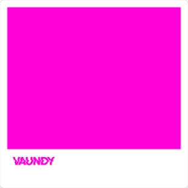

<pre>
!           ___           ___           ___                                               ___           ___                    ___           ___           ___           
!          /  /\         /  /\         /__/|         ___                                 /__/\         /  /\                  /__/\         /__/\         ___           
!         /  /::\       /  /::\       |  |:|        /  /\                                \  \:\       /  /::\                \  \:\        \  \:\       /  /\          
!        /  /:/\:\     /  /:/\:\      |  |:|       /  /:/                ___     ___      \  \:\     /  /:/\:\                \__\:\        \  \:\     /  /:/          
!       /  /:/~/:/    /  /:/~/::\   __|  |:|      /__/::\               /__/\   /  /\ ___  \  \:\   /  /:/  \:\            ___ /  /::\   ___  \  \:\   /__/::\          
!      /__/:/ /:/___ /__/:/ /:/\:\ /__/\_|:|____ \__\/\:\__            \  \:\ /  /:/ /__/\  \__\:\ /__/:/ \__\:\          /__/\  /:/\:\ /__/\  \__\:\ \__\/\:\__       
!      \  \:\/:::::/ \  \:\/:/__\/ \  \:\/:::::/    \  \:\/\            \  \:\ /:/  \  \:\ /  /:/ \  \:\ /  /:/          \  \:\/:/__\/ \  \:\ /  /:/    \  \:\/\      
!       \  \::/~~~~   \  \::/        \  \::/~~~~      \__\::/             \  \:\/:/    \  \:\ /:/   \  \:\ /:/            \  \::/        \  \:\ /:/      \__\::/      
!        \  \:\        \  \:\         \  \:\          /__/:/               \  \::/      \  \:\/:/     \  \:\/:/              \  \:\        \  \:\/:/       /__/:/       
!         \  \:\        \  \:\         \  \:\         \__\/                 \__\/        \  \::/       \  \::/                \  \:\        \  \::/        \__\/        
!          \__\/         \__\/          \__\/                                             \__\/         \__\/                  \__\/         \__\/                     
</pre>

---

### 💻 Computer Science & Engineering base

| Property | Data |
| :--- | :--- |
|**Language / IDE** |     |
| **Domain Knowledge** |   |
| **CI / CD / Tools** |     |
| **Databases** |    |
| **Frameworks** |     |
| **Machine Learning / Deep Learning** | |

---

### 🌿 Knowledge & Background Roots

<pre>
RAKI LAB
 ├── Academic (Major & Interests)
 │    ├── Philosophy (Major)
 │    │    └── Existentialism and Aesthetics
 │    └── Physics
 │         ├── Astrophysics
 │         └── Particle Physics (Dark Matter)
 │
 └── Creative Art (Professional)
      ├── Fine Arts (Techniques & Concept)
      ├── Photography (10 Years Experience)
      └── Fashion Design (Professional Major)
</pre>

---

### My Top 10 Favorite Music Albums

<table width="100%">
  <tr align="center" valign="top">
    <td width="20%">
       
      <strong>Yutaka Ozaki</strong> Seventeen's Map
    </td>
    <td width="20%">
       
      <strong>Fujii Kaze</strong> HELP EVER HURT NEVER
    </td>
    <td width="20%">
       
      <strong>Hins Cheung</strong> Live in Passion 2014
    </td>
    <td width="20%">
       
      <strong>Kelly Chen</strong> 10th Anniversary
    </td>
    <td width="20%">
       
      <strong>Lady Gaga</strong> The Fame Monster
    </td>
  </tr>
  <tr align="center" valign="top">
    <td width="20%">
       
      <strong>Madonna</strong> Madonna
    </td>
    <td width="20%">
       
      <strong>Chilly Gonzales</strong> Solo Piano II(Deluxe Edition)
    </td>
    <td width="20%">
       
      <strong>Vaundy</strong> strobo
    </td>
    <td width="20%">
       
      <strong>Sugar Club</strong> Thank You
    </td>
    <td width="20%">
       
      <strong>The 1975</strong> At Their Very Best(Live) 
    </td>
  </tr>
</table>

---
### Secret Observation Deck
<pre>
/* * [ PROJECT: HADRON COLLISION ]
 * Status: Observing Dark Matter...
 */
      .       .
       \     /
    .---( X )---.  <-- Quantum Entanglement Detected
       /     \
      '       '  ... particles decaying ...
</pre>

---
### 🌸 Spring Contribution Path

---

  

